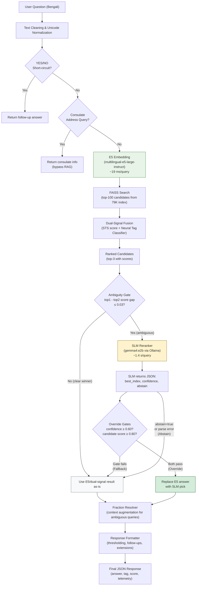

# SLM Reranker Benchmark Report — 1,128 Questions

**Date**: 2026-04-08
**Hardware**: Tesla T4, 16 GB VRAM
**Datasets**: 700 non-problematic + 428 problematic = 1,128 total
**Retrieval baseline**: multilingual-e5-large-instruct (1.1 GB) + FAISS + dual-signal fusion
**Inference backend**: Ollama (local, temperature=0.0, deterministic)
**Prompt**: `faq_judge_v1` for all 6 models (fair comparison — same prompt, same rules)
**Thinking mode**: All models run in non-thinking mode (Qwen models get `/no_think` prefix)

---

## Pipeline Architecture



---

## Column Definitions

| Column | Meaning |
| --- | --- |
| **Accuracy** | Fraction of queries where the final answer (after reranker, if any) matches the expected tag |
| **Accuracy (gold in top-3)** | Accuracy measured only on the subset where the correct answer exists in the top-3 FAISS candidates. This is the reranker's theoretical ceiling — it cannot fix queries where the correct answer is not among the candidates it sees |
| **Override Rate** | Fraction of queries where the SLM's pick actually **replaced** the original E5 answer. This requires three conditions to be met: (a) the SLM picked a candidate (did not abstain), (b) its self-reported confidence >= 0.60, and (c) the picked candidate's E5 retrieval score >= 0.80. If any condition fails, the system keeps the original E5 answer unchanged |
| **Abstain Rate** | Fraction of queries where the SLM explicitly refused to judge (returned `"abstain": true` in its JSON output), or returned unparseable/failed output. The system falls back to the original E5 answer |
| **Fallback Rate** | Implicit: `1 - Override Rate - Abstain Rate`. The SLM picked a candidate but failed a confidence or score gate. The system keeps the original E5 answer unchanged |
| **Mean Latency** | Average wall-clock time per query for the SLM inference call only (excludes E5 retrieval). Measured at the Ollama HTTP API boundary |
| **Total Time** | Wall-clock time to process all queries in that dataset (E5 retrieval + SLM inference) |
| **Net vs Vanilla** | Number of additional correct answers compared to vanilla E5 with no reranker. Positive = improvement, negative = regression |

---

## Combined Results (700 Non-Problematic + 428 Problematic = 1,128 Total)

| Model | Size | NP 700 Correct | P 428 Correct | Total Correct | Combined Accuracy | Net vs Vanilla | Total Time | Mean / Query |
| --- | ---: | ---: | ---: | ---: | ---: | ---: | ---: | ---: |
| **gemma4:e2b** | 7.2 GB | 658 / 700 | **151 / 428** | **809** | **0.717** | **+109** | 26.9 min | 1,430 ms |
| gemma4:latest | 9.6 GB | 625 / 700 | 179 / 428 | 804 | 0.713 | +104 | 29.2 min | 1,555 ms |
| qwen3:4b | 2.5 GB | 700 / 700 | 27 / 428 | 727 | 0.645 | +27 | 49.8 min | 2,651 ms |
| gemma3:1b | 815 MB | 700 / 700 | 22 / 428 | 722 | 0.640 | +22 | 39.4 min | 2,093 ms |
| titulm-gemma-2b:q4km | 1.7 GB | 700 / 700 | 20 / 428 | 720 | 0.638 | +20 | 94.7 min | 5,040 ms |
| tigerllm-1b:q4km | 806 MB | 700 / 700 | 20 / 428 | 720 | 0.638 | +20 | 46.4 min | 2,470 ms |
| vanilla (E5 only) | 1.1 GB | 700 / 700 | 0 / 428 | 700 | 0.620 | 0 | 0.4 min | 18.6 ms |
| qwen3:1.7b | 1.4 GB | 354 / 700 | 35 / 428 | 389 | 0.345 | -311 | 42.1 min | 2,239 ms |

---

## Non-Problematic Queries (700)

Questions where vanilla E5 retrieval already returns the correct answer. The reranker must **not break** these.

| Model | Accuracy | Override Rate | Abstain Rate | Fallback Rate | Mean Latency | Total Time |
| --- | ---: | ---: | ---: | ---: | ---: | ---: |
| vanilla (E5 only) | **1.000** | — | — | — | 18.6 ms | 14.4 s |
| qwen3:4b | **1.000** | 0.860 | 0.000 | 0.140 | 1,616 ms | 19.1 min |
| gemma3:1b | **1.000** | 0.397 | 0.000 | 0.603 | 1,617 ms | 19.1 min |
| tigerllm-1b:q4km | **1.000** | 0.000 | 0.000 | 1.000 | 2,925 ms | 34.4 min |
| titulm-gemma-2b:q4km | **1.000** | 1.000 | 0.000 | 0.000 | 5,162 ms | 60.5 min |
| **gemma4:e2b** | 0.940 | 1.000 | 0.000 | 0.000 | 1,367 ms | 16.2 min |
| gemma4:latest | 0.893 | 1.000 | 0.000 | 0.000 | 1,528 ms | 17.8 min |
| qwen3:1.7b | 0.506 | 0.513 | 0.483 | 0.004 | 2,911 ms | 34.2 min |

---

## Problematic Queries (428)

Questions where vanilla E5 returns the **wrong tag** with high confidence (0.957–0.997). The reranker's job is to **fix** these.

| Model | Accuracy | Accuracy (gold in top-3) | Override Rate | Abstain Rate | Fallback Rate | Mean Latency | Total Time |
| --- | ---: | ---: | ---: | ---: | ---: | ---: | ---: |
| gemma4:latest | 0.418 | **0.653** | 1.000 | 0.000 | 0.000 | 1,545 ms | 11.1 min |
| **gemma4:e2b** | 0.353 | 0.551 | 1.000 | 0.000 | 0.000 | 1,479 ms | 10.7 min |
| qwen3:1.7b | 0.082 | 0.128 | 0.582 | 0.416 | 0.002 | 1,086 ms | 7.9 min |
| qwen3:4b | 0.063 | 0.099 | 0.918 | 0.000 | 0.082 | 4,290 ms | 30.8 min |
| gemma3:1b | 0.051 | 0.080 | 0.743 | 0.000 | 0.257 | 2,817 ms | 20.2 min |
| tigerllm-1b:q4km | 0.047 | 0.073 | 0.000 | 0.000 | 1.000 | 1,671 ms | 12.1 min |
| titulm-gemma-2b:q4km | 0.047 | 0.073 | 1.000 | 0.000 | 0.000 | 4,785 ms | 34.2 min |
| vanilla (E5 only) | 0.000 | — | — | — | — | 18.6 ms | 8.8 s |

---

## Retrieval Ceiling (428 Problematic)

| Candidate Pool | Recall |
| --- | ---: |
| Top-3 | 64.0% |
| Top-5 | 79.2% |
| Top-10 | 88.8% |

No reranker operating on top-3 candidates can exceed 64.0% accuracy on this set. gemma4:latest (4-bit) reaches 65.3% of that ceiling (0.418 / 0.640). gemma4:e2b (2-bit) reaches 55.1% (0.353 / 0.640).

---

## Inference Speed Breakdown

E5 retrieval is negligible (~1.5% of the fastest SLM). SLM inference dominates entirely.

| Model | Size | E5 Retrieval (1,128 q) | SLM Inference (1,128 q) | Total | Mean / Query |
| --- | ---: | ---: | ---: | ---: | ---: |
| vanilla (E5 only) | 1.1 GB | 23.2 s | — | 23.2 s | 18.6 ms |
| gemma4:e2b | 7.2 GB | 23.2 s | 1,589.5 s | 26.9 min | 1,430 ms |
| gemma4:latest | 9.6 GB | 23.2 s | 1,730.4 s | 29.2 min | 1,555 ms |
| gemma3:1b | 815 MB | 23.2 s | 2,337.7 s | 39.4 min | 2,093 ms |
| tigerllm-1b:q4km | 806 MB | 23.2 s | 2,762.7 s | 46.4 min | 2,470 ms |
| qwen3:4b | 2.5 GB | 23.2 s | 2,967.4 s | 49.8 min | 2,651 ms |
| qwen3:1.7b | 1.4 GB | 23.2 s | 2,502.7 s | 42.1 min | 2,239 ms |
| titulm-gemma-2b:q4km | 1.7 GB | 23.2 s | 5,661.7 s | 94.7 min | 5,040 ms |

---

## Model Configuration

All models were run in **non-thinking mode** with deterministic output (temperature=0.0).

| Model | Thinking Mode | `/no_think` Injected | Prompt Style | Context Window |
| --- | --- | --- | --- | ---: |
| gemma4:e2b | N/A (Gemma has no thinking mode) | No | `faq_judge_v1` | 4,096 |
| gemma4:latest | N/A | No | `faq_judge_v1` | 4,096 |
| qwen3:4b | Disabled | Yes | `faq_judge_v1` | 4,096 |
| qwen3:1.7b | Disabled | Yes | `faq_judge_v1` | 4,096 |
| gemma3:1b | N/A | No | `faq_judge_v1` | 4,096 |
| tigerllm-1b:q4km | N/A | No | `faq_judge_v1` | 4,096 |
| titulm-gemma-2b:q4km | N/A | No | `faq_judge_v1` | 4,096 |

**Prompt style:**
- All 7 models use `faq_judge_v1`: neutral prompt that picks the most specific candidate matching the user's question. No rank bias. This ensures a fair apples-to-apples comparison across models.

**Qwen `/no_think` prefix**: Qwen3 models have a built-in thinking/reasoning mode that produces `<think>...</think>` blocks before the JSON output. The `/no_think` prefix disables this, forcing direct JSON output. Without it, qwen3:4b produces 87% parse errors due to reasoning tokens overflowing the generation budget.

---

## Latency Note: Parallel Runs

Models were evaluated in parallel chunks (2-3 models sharing the Ollama instance at a time on a single T4 GPU). Per-query latency is measured at the Ollama HTTP API boundary and may include model-swap overhead when multiple models compete for GPU VRAM.

In production, only **one** SLM model runs (gemma4:e2b). There is no model swapping. Production per-query latency for gemma4:e2b is ~1.4 s/query.

---

## Reranker Prompt Template

### `faq_judge_v1` (used by all 6 models)

```
You are a Bengali FAQ retrieval judge.
Your task is to pick the single best retrieved candidate for the user's question.
Do not answer the question yourself. Only choose the best candidate or abstain.

User question:
{user_question}

Candidates:
Candidate 1:
Tag: {tag}
Matched question: {matched_question}
Answer: {answer_preview}
Retrieval score: {score}

Candidate 2:
...

Candidate 3:
...

Return JSON only with this exact schema:
{
  "best_index": 1,
  "confidence": 0.0,
  "abstain": false
}

Rules:
- best_index must be an integer between 1 and the number of candidates.
- confidence must be a number between 0 and 1.
- If no candidate clearly matches, set abstain to true.
- Judge Bengali meaning and user intent, not surface word overlap.
- Prefer the most specific candidate that directly answers the user's question.
- Do not include markdown, explanations, or extra text.
```

### Prompt Token Budgeting

The prompt is progressively compacted if it exceeds the token budget (`num_ctx - num_predict - margin = 4096 - 128 - 256 = 3712 tokens`).

| Level | Question Limit | Candidate Q Limit | Answer Limit | Context Turns | Message Limit |
| ---: | ---: | ---: | ---: | ---: | ---: |
| 0 | 280 chars | 220 chars | 180 chars | 4 | 180 chars |
| 1 | 240 chars | 180 chars | 140 chars | 3 | 140 chars |
| 2 | 220 chars | 160 chars | 110 chars | 2 | 110 chars |
| 3 | 180 chars | 140 chars | 80 chars | 1 | 90 chars |
| 4 | 160 chars | 120 chars | 60 chars | 0 | 80 chars |

---

## Reranker Override Decision Logic

```python
# From slm_reranker.py — simplified decision flow

# 1. SLM returns JSON
parsed = {"best_index": int, "confidence": float, "abstain": bool}

# 2. Abstain check
if parsed["abstain"] or best_index is None:
    → ABSTAIN: keep original E5 answer

# 3. Override gates
should_apply = (
    parsed["confidence"] >= 0.60            # SLM is confident enough
    and candidate_score >= 0.80             # E5 retrieval score is high enough
)

if should_apply:
    → OVERRIDE: replace E5 answer with SLM's pick
else:
    → FALLBACK: keep original E5 answer (SLM picked but failed a gate)
```

---

## Actual SLM Raw Responses (Same Question, Same Prompt)

Question: "অনলাইন প্ল্যাটফর্মে লক স্ট্যাটাস কতক্ষণ ধরে থাকে?" — all 3 candidates have the same correct tag.

### gemma4:e2b → OVERRIDE

```json
{"best_index": 1, "confidence": 1.0, "abstain": false}
```

Picks Candidate 1, confidence 1.0. Gate passes (1.0 >= 0.60). SLM's pick replaces the E5 answer. This is the intended behavior — the model understood the question, chose correctly, and expressed high certainty.

### tigerllm-1b:q4km → FALLBACK (gate failed)

```json
{
  "best_index": 1,
  "confidence": 0.0,
  "abstain": false
}
```

Picks Candidate 1 (correct), but reports confidence 0.0. The model copied the placeholder value from the prompt's JSON schema example instead of computing actual confidence. Gate fails (0.0 < 0.60). System discards the pick and falls back to the original E5 answer. This happens on **100% of queries** for tigerllm — it never produces a non-zero confidence.

### qwen3:1.7b → ABSTAIN

```json
{


}
```

Returns an empty JSON object — no `best_index`, no `confidence`, no `abstain` field. The parser finds no valid fields and treats this as an abstain. System falls back to the original E5 answer. On the 700 non-problematic set, qwen3:1.7b abstains on **48.3%** of queries and on the 428 problematic set, **41.6%** of queries.

**This is a model-level limitation, not a system-level issue.** The pipeline parser and fallback logic work correctly — they handle the empty JSON gracefully by falling back to E5. The problem is that qwen3:1.7b (1.4 GB) is too small to reliably follow the prompt instructions. Given the same prompt, same candidates, and same system, other models (even gemma3:1b at 815 MB) produce valid JSON with all fields filled in. qwen3:1.7b simply cannot consistently process a Bengali question + 3 candidates + JSON schema and produce structured output.

### Summary of SLM Response Behaviors

| Model | Returns Valid JSON? | Fills Confidence Correctly? | Typical Response | Override Rate (NP 700 / P 428) | Capability |
| --- | --- | --- | --- | --- | --- |
| gemma4:e2b | Always | Yes (real values 0.9-1.0) | `{"best_index": N, "confidence": 0.9+, "abstain": false}` | 1.000 / 1.000 | Fully capable |
| gemma4:latest | Always | Yes (real values 0.9-1.0) | `{"best_index": N, "confidence": 0.9+, "abstain": false}` | 1.000 / 1.000 | Fully capable |
| titulm-gemma-2b:q4km | Always | Yes (real values 0.9+) | `{"best_index": N, "confidence": 0.9+, "abstain": false}` | 1.000 / 1.000 | Fully capable |
| gemma3:1b | Always | Yes (real values 0.9+) | `{"best_index": N, "confidence": 0.9+, "abstain": false}` | 0.397 / 0.743 | Fully capable |
| qwen3:4b | Always | No (copies 0.0 placeholder) | `{"best_index": N, "confidence": 0.0, "abstain": false}` | 0.860 / 0.918 | Partial |
| tigerllm-1b:q4km | Always | No (copies 0.0 placeholder) | `{"best_index": 1, "confidence": 0.0, "abstain": false}` | 0.000 / 0.000 | Partial |
| qwen3:1.7b | ~55% of the time | No (empty JSON or missing fields) | `{}` or `{"abstain": true}` | 0.513 / 0.582 | Broken |

> Data also available in `model_prompt_capability.csv` and `model_prompt_capability.xlsx`.

---

## Key Findings

1. **gemma4:e2b is the clear winner** — best combined accuracy (0.717), best net gain (+109), and fastest SLM (1,430 ms/query). Only model that meaningfully fixes problematic queries (35.3%) while maintaining 94.0% on non-problematic. It overrides 100% of queries and never abstains.

2. **gemma4:latest (4-bit) is NOT better than e2b (2-bit)** — the 4-bit version fixes more problematic queries (179 vs 151, reaching 65.3% of the top-3 ceiling) but introduces far more NP regressions (75 vs 42). Net +104 vs e2b's +109. It is also 2.4 GB larger (9.6 vs 7.2 GB), leaving only ~3 GB headroom on T4 when E5 + FAISS are loaded — risky for production. The 2-bit quantization is the better production choice.

2. **Four models achieve perfect NP 700** — qwen3:4b, gemma3:1b, tigerllm-1b, and titulm-gemma-2b all score 1.000 on non-problematic queries. But they only fix 4.7–6.3% of problematic ones, adding 1.6–5.2 seconds of latency per query for marginal gains (+20 to +27).

3. **qwen3:1.7b is unusable** — slowest effective model (2,239 ms/query) and destroys non-problematic accuracy (50.6%), net -311 vs vanilla. Abstains on 42–48% of queries.

4. **tigerllm-1b never overrides** — 0% override rate on both datasets. It runs inference (~2.5 s/query) but always falls back to E5. Equivalent to vanilla with added latency.

5. **titulm-gemma-2b is the slowest** — 5,040 ms/query mean, 94.7 min for 1,128 questions. Perfect on NP 700 but only fixes 20 problematic queries. Not worth the latency.

6. **E5 retrieval is not the bottleneck** — 18.6 ms/query vs 1,086–5,162 ms for SLM. Any speed optimization effort should target the SLM layer.

7. **Production recommendation** — deploy gemma4:e2b as the SLM reranker. At ~1.4 s/query it adds meaningful latency, but it is the only model that delivers a real accuracy gain (+109 correct answers across 1,128 queries). In production, the reranker is gated behind the ambiguity check (top-1 minus top-2 score gap <= 0.03), so it only fires on uncertain retrievals — not every request.
