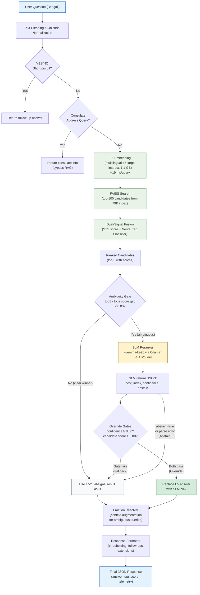

# EC FAQ Bot — Full Pipeline Architecture

## Stage Breakdown

| Stage | Component | File | Latency |
| --- | --- | --- | ---: |
| 1 | Text cleaning & normalization | `e5/text_processing.py` | < 1 ms |
| 2 | YES/NO short-circuit | `e5/handlers/yesno_handler.py` | < 1 ms |
| 3 | Consulate detection | `e5/handlers/consulate_handler.py` | < 1 ms |
| 4 | E5 embedding + FAISS search | `e5/pipeline/rag_system.py` | ~19 ms |
| 5 | Dual-signal fusion | `e5/pipeline/dual_signal_wrapper.py` | < 1 ms |
| 6 | Ambiguity gate | `e5/pipeline/search_stage.py` | < 1 ms |
| 7 | SLM reranker (if triggered) | `e5/pipeline/slm_reranker.py` | ~1,400 ms |
| 8 | Fraction resolver | `e5/pipeline/fraction_resolver.py` | < 1 ms |
| 9 | Response formatter | `e5/handlers/response_formatter.py` | < 1 ms |

**Total latency**: ~19 ms (no reranker) or ~1,420 ms (with reranker). The SLM reranker only fires when the ambiguity gate triggers (top-1 minus top-2 score gap ≤ 0.03).
