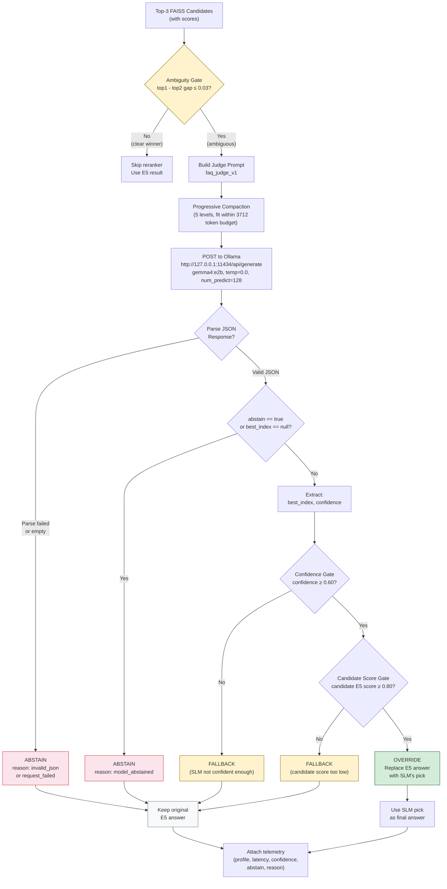
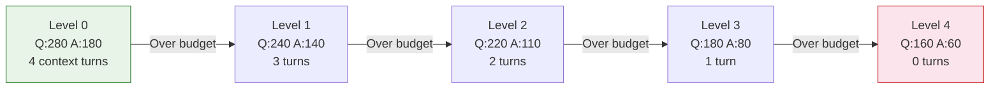
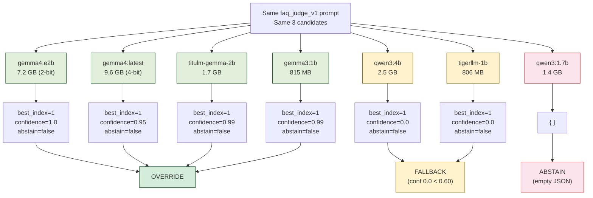

# SLM Reranker — Decision Flow & Design

## Reranker Decision Flow



## Three Possible Outcomes

| Outcome | When | Final Answer | Telemetry |
| --- | --- | --- | --- |
| **OVERRIDE** | SLM picked a candidate, confidence ≥ 0.60, candidate score ≥ 0.80 | SLM's pick | `should_apply=true` |
| **FALLBACK** | SLM picked but failed a gate (low confidence or low candidate score) | Original E5 | `should_apply=false, abstain=false` |
| **ABSTAIN** | SLM returned `abstain=true`, empty JSON, or request failed | Original E5 | `should_apply=false, abstain=true` |

## Prompt Template (`faq_judge_v1`)

```
You are a Bengali FAQ retrieval judge.
Your task is to pick the single best retrieved candidate for the user's question.
Do not answer the question yourself. Only choose the best candidate or abstain.

[Recent conversation context (if available):]
[- user: {message}]
[- assistant (tag=X): {message}]

User question:
{user_question (max 280 chars, progressively compacted)}

Candidates:
Candidate 1:
Tag: {tag}
Matched question: {matched_question (max 220 chars)}
Answer: {answer_preview (max 180 chars)}
Retrieval score: {score}

Candidate 2:
...

Candidate 3:
...

Return JSON only with this exact schema:
{
  "best_index": 1,
  "confidence": 0.0,
  "abstain": false
}

Rules:
- best_index must be an integer between 1 and the number of candidates.
- confidence must be a number between 0 and 1.
- If no candidate clearly matches, set abstain to true.
- Judge Bengali meaning and user intent, not surface word overlap.
- Prefer the most specific candidate that directly answers the user's question.
- Do not include markdown, explanations, or extra text.
```

## Prompt Token Budgeting

Total budget: `num_ctx (4096) - num_predict (128) - margin (256) = 3712 tokens`

If the prompt exceeds the budget, it is progressively compacted through 5 levels:



| Level | Question | Candidate Q | Answer | Context Turns | Message |
| ---: | ---: | ---: | ---: | ---: | ---: |
| 0 | 280 chars | 220 chars | 180 chars | 4 | 180 chars |
| 1 | 240 chars | 180 chars | 140 chars | 3 | 140 chars |
| 2 | 220 chars | 160 chars | 110 chars | 2 | 110 chars |
| 3 | 180 chars | 140 chars | 80 chars | 1 | 90 chars |
| 4 | 160 chars | 120 chars | 60 chars | 0 | 80 chars |

## Model Behavior Comparison



## Ollama Configuration

```
Model:        gemma4:e2b (production recommendation)
Backend:      Ollama (http://127.0.0.1:11434/api/generate)
temperature:  0.0 (deterministic)
num_predict:  128 (max output tokens)
num_ctx:      4096 (context window)
timeout:      90 seconds
```

## Production Gates Summary

The reranker has **three layers of safety** preventing bad overrides:

1. **Ambiguity gate** (pre-SLM): Only invoke SLM when top-1 and top-2 scores are within 0.03. Clear winners skip the SLM entirely — no latency added.
2. **Confidence gate** (post-SLM): SLM must report confidence ≥ 0.60. Low-confidence picks are discarded.
3. **Candidate score gate** (post-SLM): The picked candidate's E5 retrieval score must be ≥ 0.80. Ensures the SLM only picks from reasonably good candidates.

If any gate fails, the original E5 answer is preserved unchanged.
